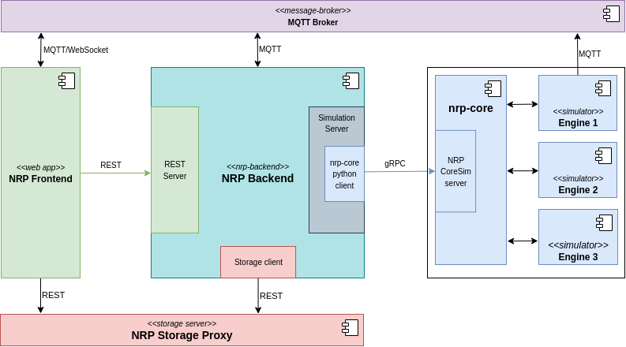
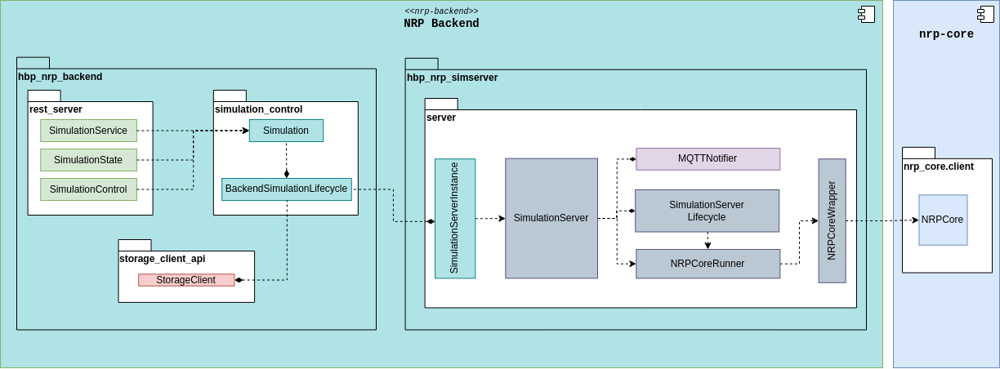

========================
NRP Backend Architecture
========================

Purpose
-------

The :term:`NRP` Backend is responsible for providing a :ref:`backend-rest-api` to launch and control simulated experiments.
Such experiments leverage the :ref:`doxid-indexpage` framework for orchestrating and synchronize different simulators.

Experiments are run by executing user-defined python scripts (usually named :code:`main_script.py`) using nrp-core :ref:`python client <doxid-python_client>` to advance the simulation.

Using the REST API provided by NRP Backend, the user can request an experiment to be:

* launched
* paused
* resumed
* stopped

Architecture of the NRP
-------------------------------

.. _architecture-components:

   Architecture of NRP Backend with NRP Frontend and nrp-core.

The component diagram in :numref:`architecture-components` depicts the architecture of the NRP, showing NRP Backend alongside :code:`NRP Frontend` and :code:`nrp-core` and the :code:`Simulation Server`.
The REST API server takes requests, coming from NRP Frontend, and fulfils them interacting with the :code:`Storage Client` to fetch the experiment data, and the :code:`Simulation Server` to run it.

The :code:`Storage Client` access the storage, where the experiment's data are kept, via the :code:`Storage Proxy`'s REST interface.

The :code:`Simulation Server` manages the execution of the experiment's :code:`main_script.py` that drives :code:`nrp-core`'s simulation via its python client.

A :term:`MQTT` broker is used to send runtime information (e.g. status of the simulation, errors) to the Frontend and to exchange messages between backend's internal components (i.e. :ref:`rest-server` and :ref:`simulation-server`).

Details on the REST API can be found here: :doc:`REST-API`.

Architecture of NRP Backend
-------------------------------

.. _backend-components:

   Architecture of NRP Backend

The component diagram in :numref:`backend-components` details the structure of NRP Backend and its packages  :code:`hbp_nrp_backend` and  :code:`hbp_nrp_simserver`.
The first implements the :ref:`rest-server` and the second the :ref:`simulation-server` that runs nrp-core simulation scripts.
