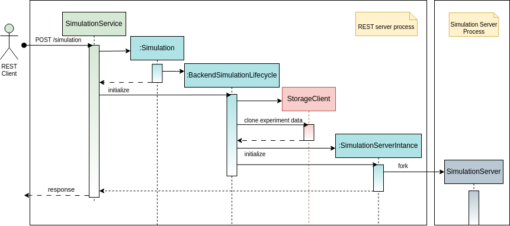
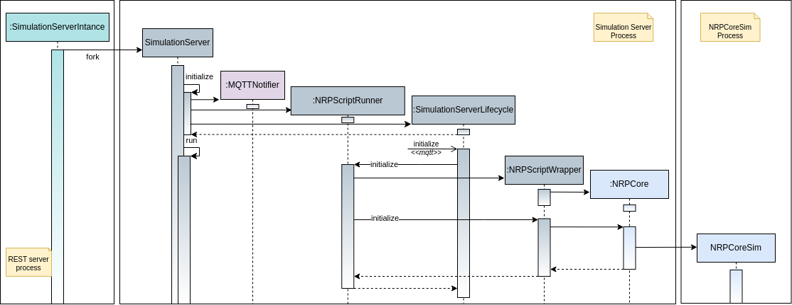

======================
NRP Backend Components
======================

.. _rest-server:

REST Server
++++++++++++++++++++

The REST Server implemented in the package :code:`hbp_nrp_backend`.
It takes care of exposing the execution of npr-core based experiment as REST resources.
It leverages the `Flask <https://flask.palletsprojects.com/>`_  and `Flask-Restful <https://flask-restful.readthedocs.io>`_ frameworks
to implement REST Services that can create, manage, and stop experiments (see :ref:`backend-rest-api`).

One of its responsibilities is to manage the local execution environment in the context of which the :code:`Simulation Server` will run the experiment.
When serving an experiment launching request, it takes care of fetching the experiment data from the :code:`Storage Server`, for the use of the :code:`Simulation Server`.
Once the simulation has successfully (or unsuccessfully) terminated, it upload the simulation logs to the :code:`Storage Server` for the user to inspect.

Another responsibility is, once having prepared the execution environment, to spawn a :code:`Simulation Server` that will execute the nrp-core based simulation script controlling the requested experiment.

.. _launch-experiment-backend:

   Experiment launching (REST Server)

The sequence diagram :numref:`launch-experiment-backend`, depicts such processes.

In the REST Server, the lifecycle of an experiment simulation is governed by an instance of :code:`SimulationLifecycle`; in particular, by its specialization  :code:`BackendSimulationLifecycle`.
For details see the :ref:`relative <life-cycles>` section of this manual.

.. _simulation-server:

Simulation Server
++++++++++++++++++++

The purpose of the Simulation Server is to run nrp-core based python scripts from a local directory prepared by the :ref:`rest-server`.
When the launching of an experiment is requested, it gets spawned, as sub process, by the :ref:`rest-server`.
It, then, loads and executes the experiment script (e.g. main_script.py) until completion or user request of stopping it. While running, the execution can be paused.

.. note:: The :ref:`simulation-server` can pause and stop the execution of nrp-core based python script; i.e. python scripts with the following structure. It is required to use the function :code:`nrp.run_loop` to loop over simulation timesteps or until the exception :code:`NRPSimulationTimeout` is raised.

.. literalinclude:: img/main_script.py
   :linenos:
   :name: main_script.py

The execution can be controlled because any programmatic interaction with nrp-core python client (i.e. :code:`nrp_client`) is mediated by the class :code:`NRPCoreWrapper`.
This class wraps an instance of :code:`NrpCore` intercepting any call and, before forwarding the call to the wrapped instance, it performs all the required management tasks (e.g. time keeping, checking whether pause or stop has been requested).

The sequence diagram in :numref:`launch-experiment-simserver`, depicts the process of launching an experiment. It is the continuation of :numref:`launch-experiment-backend`.

.. _launch-experiment-simserver:

   Experiment launching (Sim Server)

The lifecycle of a :ref:`simulation-server` is governed by an instance of :code:`SimulationLifecycle`, in particular by its specialization :code:`SimulationServerLifecycle`.
For details see the :ref:`relative <life-cycles>` section of this manual.
