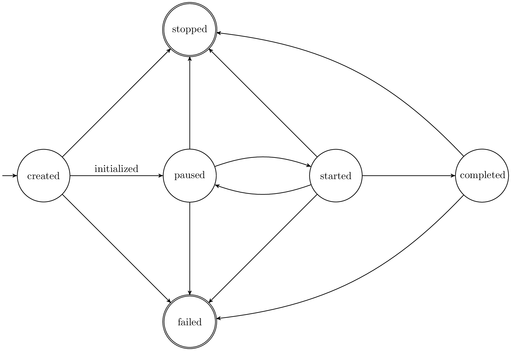

.. _life-cycles:

==========================================
NRP Backend's life-cycle state machine 
==========================================

.. _state-machine:

    The state machine of the NRP Backend

The state machine of our current implementation of the NRP backend is depicted in :ref:`state-machine`.
It shows the allowed transitions between states, including failure transitions.

The initial *created* state is reached after a :code:`POST /simulation` request.
Transitions between states are triggered by a :code:`PUT /simulation/{id}/state` with the transition trigger as body (the target state).

For example, the transition to initialize a freshly created simulation is triggered by *initialized* and will execute the *initialize* trigger,
depicted in :ref:`state-machine` through the arrow annotated with *initialized*.

When a transition is triggered, one of the transition implementations is executed, *initialize*, *start*, *pause*, *stop*, *fail*.
If any transition fails, the state machine resides in its current state and an automatic *failed* transition is triggered.
All transitions will be ignored if they are issued multiple times.

The semantic of the states is the following:
 :code:`created`: The simulation is created, his creation date has been set.

 :code:`pause`: The simulation has been initialized, the required resources have been allocated.

 :code:`started`: The experiment script is being executed.

 :code:`completed`: The execution of the experiment script is completed (successfully or unsuccessfully due to a runtime error). Resources have not been freed.

 :code:`stopped`: Simulation resources have been freed and the logs have been uploaded to the storage

 :code:`failed`: The simulation has failed for some fatal error. Logs are should be available for inspection on the storage.

See :doc:`REST-API` for details on requests to NRP Backend API.

Synchronization of multiple life-cycles 
---------------------------------------

The state machine allows multiple distributed instances of itself over multiple processes or hosts, each 
having different implementations of the transition functions. 
These instances are automatically kept in synch using an MQTT topic.
This means, when one instance of the lifecycle state machine changes its state, all other instances are notified via a message sent on this MQTT topic.

Any other instance will receive it and synchronize automatically, but it will not propagate this synchronized change any further in order to avoid endless loops.

Lifecycle instances are identified by their unique name. To avoid collisions, the topic name is prefixed by the name and simulation ID: **<>name>/<simulation id>/lifecycle**.

In our case we have two Lifecycle instances: :code:`BackendSimulationLifecycle` and :code:`SimulationServerLifecycle`. 

.. caution:: Being *asynchronous* and *distributed*, the two life-cycles are only **eventually consistent**; i.e. they are not **always** in synch, but they should eventually be.  
    For instance, on launching a simulation, the BackendSimulationLifecycle is in a created state even if SimulationServerLifecycle hasn't even started yet. 
    In fact, nrp-frontend should wait the latter to signal its state before allowing the user to send any further simulation control
    Never assume that the state changes are synchronous nor instantaneous.
